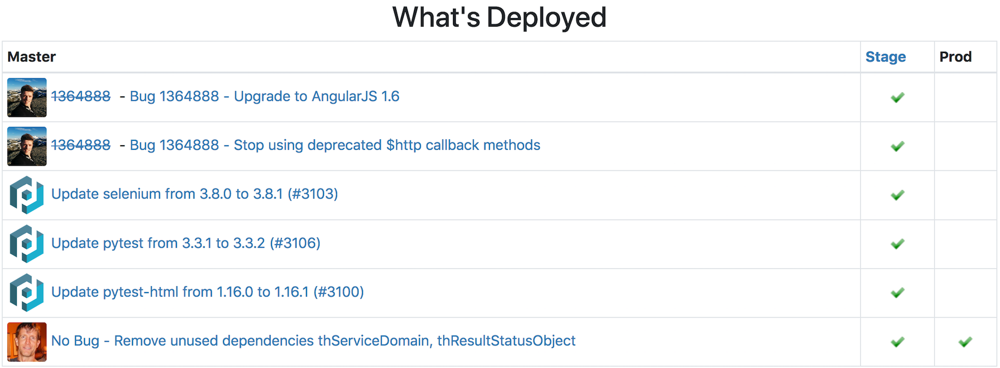

What's Deployed?
================

What's deployed from a GitHub repo on various server environments?

This requires that you have 2 or more URLs that return a git sha that
references which git sha has been deployed.

Screenshots
-----------

### Main table


### "Culprits"


License
-------

[MPL 2.0](http://www.mozilla.org/MPL/2.0/)

Credits
-------

[Checkbox icon](https://www.iconfinder.com/icons/282474/check_done_ok_icon#size=16)
by [IcoCentre](https://www.iconfinder.com/konekierto).

Development
-----------

You can either do development with Docker (recommended) or with a plain
Python `virtualenv`.

**Docker**

```
docker-compose up web
```

If it doesn't close properly when you `Ctrl-C` and you get the
"ERROR: Aborting" warning message. Type:
```
docker-compose stop
```

Remember, if you change your `docker-compose.yml` or `requirements.txt`
you can rebuild with:
```
docker-compose build web
```

**Virtualenv**

```
pip install -r requirements.txt
DEBUG=1 SQLALCHEMY_DATABASE_URI='postgres:///whatsdeployed' ./app.py
```

Then, go to http://localhost:5000/

To avoid hitting rate limits on GitHub's API you can go to
[Personal access tokens](https://github.com/settings/tokens) and generate
a token (without any scopes). How can you set:
```
export GITHUB_AUTH_TOKEN=afefdf213840aeb8007310ab05fc33eda51a0652
```

**Environment variables**

If either way you use Docker or Virtualenv you *can* put all your
environment variables into a `.env` file.
